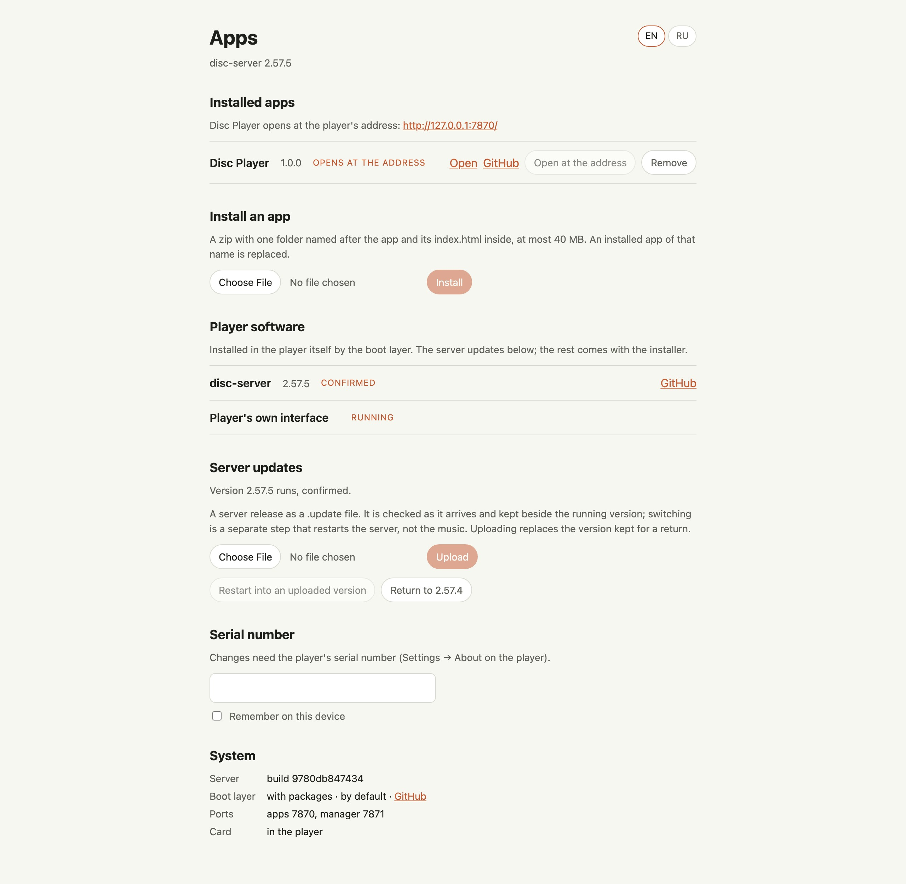
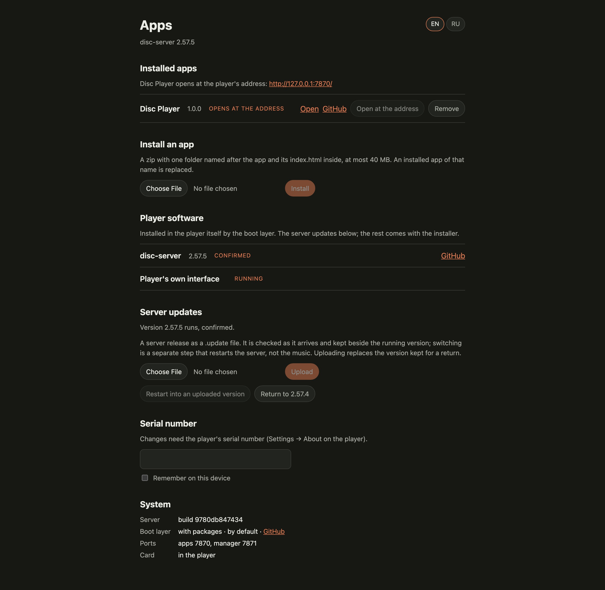
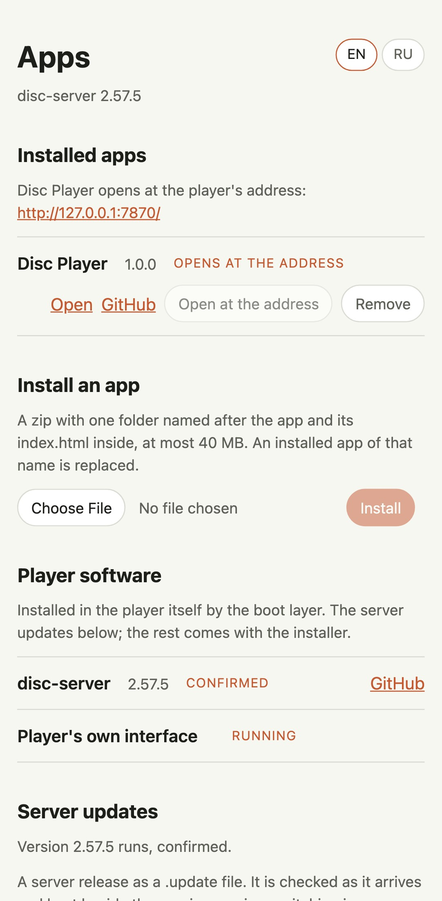

# DISC server

**The bridge between your SNOWSKY DISC and the browser: the player serves
Disc Player and your other web apps over its own Wi-Fi.**

An unofficial service for the SNOWSKY DISC, not affiliated with FiiO or
SNOWSKY. It runs on the player next to its own software, as a package of the
[DISC boot layer](https://github.com/eudj1n/snowsky-disc-boot): it serves the
apps on the memory card, lets them browse the collection and control playback
through the player's own protocol, keeps play history, playlists and the
apps' data on the card, and comes with a page of its own to manage the apps
and update itself. The music keeps playing through all of it.

[What it does](#what-it-does) · [The application manager](#the-application-manager) ·
[Safety](#safety) · [What you need](#what-you-need) · [Changelog](CHANGELOG.md) ·
[Releases](https://github.com/eudj1n/snowsky-disc-server/releases)

  

_The application manager on the disposable test player
([about the pictures](docs/images/README.md))._

## What it does

  
   Disc Player, the app the server serves first (its own project, with its fictional demo collection)

| Capability                    | What you get                                                                                                                                                                                             |
| ----------------------------- | -------------------------------------------------------------------------------------------------------------------------------------------------------------------------------------------------------- |
| **Apps from the card**        | [Disc Player](https://github.com/eudj1n/snowsky-disc-player), or any web app, lives in the card's `Apps` folder; the one you choose opens at the player's address.                                      |
| **The player in the browser** | Apps browse the library and control playback, volume, the queue and the sound settings over the player's own protocol, every change checked against the player's answer.                                 |
| **What the player keeps**     | Play history, playlists as M3U files, pins, dislikes, MusicBrainz identities and chosen pictures, in a small database on the card, the same for every browser.                                          |
| **The card's files**          | Upload music and folders, browse the card, read covers, lyrics and audio facts, play a card's file in the browser, and a trash that restores what was moved there.                                       |
| **An application manager**    | A page of its own: install an app from a zip, remove apps, choose the one that opens at the address, see the player's software.                                                                         |
| **Updates that can go back**  | A signed release replaces the server while the music plays; a version that fails at its start gives way to the previous one by itself, and the manager returns to it by hand.                           |

## The application manager

Open `http://<player-ip>:7871/` in a browser on the same network. It lists the
installed apps and opens the chosen one at the player's address
(`http://<player-ip>:7870/`). An app comes as a zip with one folder named
after the app; installing replaces an app of the same name, written beside the
old one first, so a failed installation leaves the card as it was.

"Player software" names what the boot layer runs: this server, the menu, the
interfaces installed beside the player's own and the services, background
programs beside the server (whether each runs, or why not). "Server updates" takes a
server release as a signed `.update` file, checks it as it arrives, keeps it
beside the running version and restarts into it on request; the new version is
confirmed after three minutes of steady work.

Changes need the player's serial number (Settings → About on the player),
entered once in the browser. The page speaks English and Russian, the
player's own language at first.

<table>
  <tr>
    <td align="center"></td>
    <td align="center"></td>
  </tr>
</table>

## Safety

- **The player stays the player.** The server runs beside its own software
  and never replaces it; holding a key at power-on starts the player as it
  came, and the boot layer returns to the previous server when a new one
  fails.
- **Only what is reviewed.** Apps reach the player only through commands a
  reviewed list allows, and the player's destructive commands are refused
  outright. One app controls the player at a time, and a command whose result
  is unknown is never repeated by itself.
- **Changes need the serial number**, under attempt limits; it is never
  served back and never leaves the local network.
- **No cloud, no account.** The server answers on your local network only;
  apps ask outside sources only when you allow them in the app.

## What you need

- A SNOWSKY DISC with firmware V2.57 and the
  [DISC boot layer](https://github.com/eudj1n/snowsky-disc-boot), which
  installs this server as its `service` package. Its documentation will
  describe the installation.
- The player on your Wi-Fi network (set up on the player itself) and a
  browser on the same network.

Each release carries the server as the boot layer's package
(`disc-server-<version>.zip`). The manager's update takes the same release as
a signed `.update` file, made with the project's release key; publishing it
with the releases is in the [plan](docs/plan.md).

## For developers

Start with [AGENTS.md](AGENTS.md), the [architecture](docs/architecture.md),
the [gateway contract](docs/gateway-contract.md) and
[`openapi.yaml`](openapi.yaml), and the [development guide](docs/development.md)
for building, the disposable test player and releases; the
[plan](docs/plan.md) records what was done and why.

## License & scope

Independent project, not affiliated with or endorsed by FiiO or SNOWSKY.
[MIT licensed](LICENSE); the bundled libraries keep their own licenses
(`device/licenses`). FiiO's firmware is not part of this repository or its
releases.
